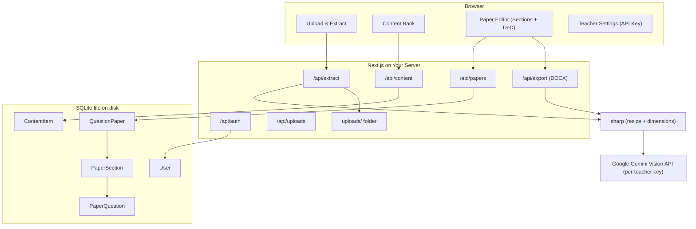

# Examint — Design Plan

## Why Not SQL Server or Supabase?

- **SQL Server** — Proprietary Microsoft product, paid licensing, very heavyweight. Rejected.
- **Supabase cloud** — Free tier pauses projects after 1 week of inactivity; paid plans required for production. Rejected.
- **Supabase self-hosted** — Open source but requires ~8 Docker containers running simultaneously. Not lightweight. Rejected.
- **PostgreSQL** — Excellent but requires installation, a DB user, password, and connection string. Too much setup friction for school use.

---

## Final Tech Stack — 100% Open Source, Zero Cost

- **Next.js 14** (MIT) — full-stack; React frontend + API routes in one project
- **SQLite via Prisma ORM** (Apache 2.0) — zero installation; a single `.db` file on disk. Prisma handles migrations with a simple schema file. Ideal for school-scale multi-user use.
- **NextAuth.js / Auth.js** (ISC) — open source auth; email+password with bcrypt; session cookies; no external service
- **Local filesystem (`uploads/`)** — uploaded images saved to disk; served as static files
- **`sharp`** (Apache 2.0) — server-side image resizing before sending to Gemini, and reading image dimensions for DOCX embedding
- **`formidable`** (MIT) — multipart file upload parsing (replaces `multer`, which is Express-only and incompatible with Next.js App Router)
- **Google Gemini 1.5 Flash API** — free tier per teacher's own Google AI Studio key (each teacher adds their key in account settings). No shared quota risk.
- **`react-easy-crop`** (MIT) — client-side image crop and zoom before upload; uses browser Canvas API to output the cropped region as a Blob (no server round-trip needed)
- **`@dnd-kit/core`** (MIT) — drag-and-drop for paper composition
- **`docx`** (MIT) — DOCX file generation, including embedded images
- **Tailwind CSS + shadcn/ui** (MIT) — UI components

---

## Architecture Overview



---

## Data Models (Prisma Schema)

```
User
  id, name, email, passwordHash, geminiApiKey (encrypted), createdAt

ContentItem
  id, userId, type, textContent, imageUrl, sourceImageUrl, createdAt
  type: paragraph | question | photo | diagram | heading | other

QuestionPaper
  id, userId, title, numberingFormat, headerConfig (JSON), footerConfig (JSON), createdAt
  headerConfig: { schoolName, subject, class, date, logoUrl, instructions }
  footerConfig: { showPageNumbers, signatureLine, customText }
  numberingFormat: "1." | "Q1." | "(i)" | "a)"

PaperSection
  id, paperId, title, instructions, order
  (e.g. "Section A — Attempt any 5 questions")

PaperQuestion
  id, sectionId, contentItemId, snapshotText, snapshotImageUrl, marks, order
  snapshotText/snapshotImageUrl: COPIED at time of adding to paper — paper is frozen
  from changes to the source ContentItem
```

> **Key design decision:** `PaperQuestion` stores `snapshotText` and `snapshotImageUrl` — a copy of the content at the time the teacher adds it to the paper. This means editing a ContentItem later does NOT silently change finalized papers.

---

## Pages & User Flow

### 1. Auth (`/login`, `/signup`)
Email + password. NextAuth.js credentials provider. Passwords hashed with bcrypt and stored in SQLite.
The login page prominently displays the app name and tagline to introduce new users:
> **Examint** — *Snap. Select. Set the paper.*

### 2. Teacher Settings (`/settings`)
- Change name/email/password
- Enter and save Gemini API key (stored encrypted in the `User` row)
- "Test Key" button — makes a minimal Gemini call to verify the key works before first upload

### 3. Dashboard (`/`)
Stats: total content items, number of papers. Quick links to Upload and Content Bank.

### 4. Upload & Extract (`/upload`)
- Drag-and-drop or click-to-upload one or more photos
- **Crop/Resize step (new):** For each selected image, a modal opens with `react-easy-crop`:
  - Teacher drags the crop rectangle to frame the relevant content
  - Zoom slider to zoom in/out
  - Optional rotation control (for skewed photos)
  - "Confirm Crop" → Canvas API renders the cropped region as a Blob in memory
  - "Skip" button bypasses crop and uses the original image
  - For multiple images, each is cropped in turn before proceeding
- Cropped Blob is uploaded to the server via FormData
- `formidable` parses the upload; `sharp` resizes to max 1200px width as a safety net
- Loading spinner shown while Gemini processes (typically 5–15 seconds)
- On Gemini failure (quota exceeded, network error, malformed response): clear error message + Retry button
- Side-by-side view: cropped photo left, extracted blocks right
- Per block: change category, edit text, check/uncheck to include
- "Save Selected" → stores chosen blocks as `ContentItem` rows; `snapshotText` and `imageUrl` saved in SQLite

### 5. Content Bank (`/content`)
- Paginated grid/list (20 items per page — handles large banks without performance issues)
- Filter by category (Paragraph, Question, Photo, etc.), full-text keyword search
- Edit text or category inline; delete items
- Color-coded category chips

### 6. Paper Editor (`/papers/new`, `/papers/[id]`)
- Two-panel layout:
  - Left: searchable, paginated Content Bank sidebar
  - Right: Paper canvas organized into sections
- **Sections:** "Add Section" button inserts a named block (e.g. "Section A — Attempt any 5 questions — 10 marks"). Questions are added within a specific section.
- Drag items from sidebar into a section, or click "+" per section. Duplicate guard: if the same ContentItem is already anywhere in the canvas, show a warning toast and do not add again.
- Per-item: marks input, drag handle to reorder within section, remove button, inline text override
- Marks per section + grand total shown live at top
- Header/Footer config in a slide-out drawer: school name, subject, class/grade, exam date, logo upload, question numbering format, page number toggle, signature line label, custom footer text
- "Preview" button: renders an HTML approximation of the DOCX inside the editor so the teacher can check layout before exporting
- "Export DOCX" → `/api/export` → downloads `.docx`

### 7. Papers List (`/papers`)
- Table: title, subject, date, sections count, total marks
- Actions: edit, duplicate, delete

---

## Key Implementation Details

- **Gemini prompt:** Image sent as base64. Prompt instructs the model to return a JSON array: `[{ type: "paragraph"|"question"|"photo"|"diagram"|"heading"|"other", text: "..." }]`. For photo/diagram regions, `text` is a brief AI-generated description. Structured output mode used where supported.
- **File upload:** `formidable` parses the multipart POST; `sharp` resizes to 1200px max; UUID-named file written to `./uploads/<userId>/`. No filename collisions possible.
- **File security:** Only `image/jpeg`, `image/png`, `image/webp` accepted; max 10 MB enforced server-side.
- **DOCX generation with embedded images:** `/api/export` reads the paper sections and questions from DB. For `photo`/`diagram` questions, `sharp` reads the snapshot image file to get pixel dimensions, then `docx` `ImageRun` embeds it as a binary buffer. Text questions are `Paragraph` nodes. Header rendered as a styled table (logo + school details). Footer rendered with page number field if enabled.
- **Drag-and-drop:** `@dnd-kit` `DndContext` wraps the editor. `useSortable` handles within-section reordering. A custom droppable zone per section accepts items dragged from the sidebar.
- **Content snapshot:** When a `ContentItem` is added to the paper, `snapshotText` and `snapshotImageUrl` are copied immediately into `PaperQuestion`. The paper is frozen from future edits to the source item.
- **Gemini API key:** Fetched from the logged-in teacher's `User.geminiApiKey` field at request time. Encrypted at rest using `NEXTAUTH_SECRET` as the encryption key.
- **Auth guard:** Next.js middleware checks session on all `/app/*` and `/api/*` routes; redirects to `/login` if unauthenticated.
- **Uploads backup note:** The `uploads/` folder is the only data not in SQLite. The deployment README must document backing up both `prisma/dev.db` and `uploads/` to avoid data loss.

---

## Project Structure

```
src/
  app/
    (auth)/
      login/        page.tsx
      signup/       page.tsx
    (app)/
      page.tsx                    ← dashboard
      settings/     page.tsx      ← API key + profile
      upload/       page.tsx
      content/      page.tsx
      papers/
        page.tsx                  ← list
        [id]/       page.tsx      ← editor
    api/
      auth/         route.ts      ← NextAuth handler
      extract/      route.ts      ← formidable + sharp + Gemini
      content/      route.ts
      papers/       route.ts
      export/       route.ts      ← DOCX builder
      uploads/[...path]/route.ts  ← serve local images with auth check
  components/
    ImageCropEditor/       ← react-easy-crop modal; outputs cropped Blob
    ContentCard/
    PaperCanvas/
    PaperSection/
    ExtractReview/
    HeaderFooterEditor/
    PaperPreview/
  lib/
    prisma.ts          ← Prisma client singleton
    gemini.ts          ← Gemini API wrapper
    docx-builder.ts    ← DOCX generation logic
    auth.ts            ← NextAuth config
    encrypt.ts         ← API key encryption/decryption
prisma/
  schema.prisma
uploads/               ← gitignored, server image storage; MUST be backed up
```

---

## Known Risks & Mitigations

- **Gemini free-tier quota** (15 req/min per key): Since each teacher uses their own key, one teacher cannot exhaust another's quota. Risk: low.
- **SQLite concurrent writes**: SQLite serializes writes. For 10–20 teachers saving simultaneously, this is a non-issue. For 100+ concurrent writes, PostgreSQL would be needed — but this is a school, not a SaaS platform.
- **`uploads/` data loss**: Not in SQLite, not in git. Mitigation: deployment README documents a simple daily backup script (copy folder to an external drive or network share).
- **`sharp` native binaries**: `sharp` uses native C++ bindings. On Windows, it requires Visual C++ Build Tools to install. This needs to be documented in the setup guide.

---

## What is NOT in scope (keep it simple)

- Real-time collaboration between teachers
- Mobile app
- Question paper templates library
- Automatic question generation by AI (extraction only, not generation)
- Grading or student-facing features
- Sub-question marks breakdown (e.g. part a = 2 marks, part b = 3 marks) — can be added later
